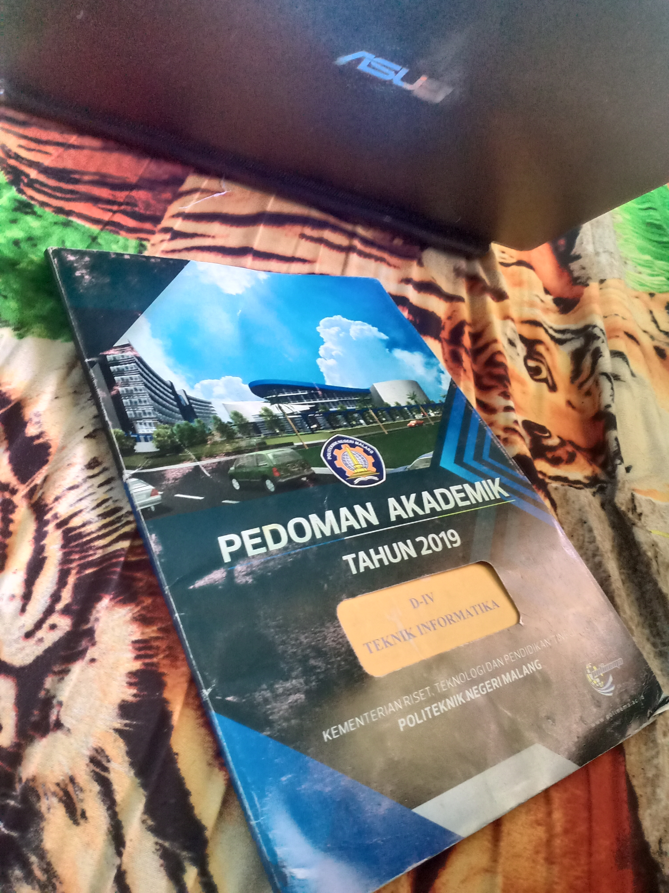

 PRAKTIKUM | PERTEMUAN 1

## Program Objek Buku

> Gambar Objek Buku

> Program Code

**_class_ Buku**

**_class_ Buku_Cerpen**

**_Hasil_Output**

----------------------------------------------------------------------------------------

**_class_Mobil**

**_class_DemoMobil**

**_Hasil_Output**

-----------------------------------------------------------------------------------------

**_class_Hape**

**_class_DemoHape**

**_hasil_output**

